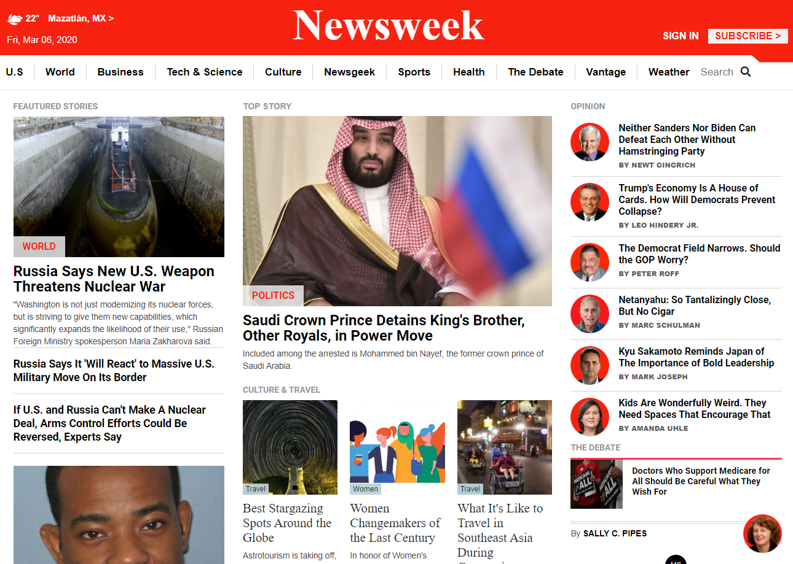

# Newsweek-clone

This is a microverse project to recreate the Newsweek page.

## Built With

- HTML
- CSS

## Preoject specific

- Used Bootstrap CSS classes wherever it is possible - this is the main point of this project.
- Used a mobile first approach when dealing with mediaqueries with 2 breakpoints.
- Double-check for breakpoints of page layout on smaller screens.

## Live Demo

[Live Demo Link](https://rawcdn.githack.com/JohannRodriguez/The-Next-Web-Clone/e445bc6e9d619891a257411ba935fcff1198373d/index.html)

## Author

👤 **Johann Alonso Rodríguez Vázquez**

- Github: [@JohannRodríguez](https://github.com/JohannRodriguez)
- Linkedin: [linkedin](https://www.linkedin.com/in/johann-alonso-rodr%C3%ADguez-v%C3%A1zquez-25b07719a/)

## 🤝 Contributing

Contributions, issues and feature requests are welcome!

Feel free to check the [issues page](issues/).

## Show your support

Give a ⭐️ if you like this project!
